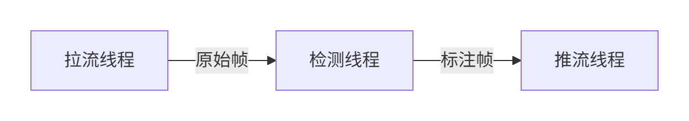

# Quahog

#### 介绍
中国地质大学（北京）信息工程学院研究生春季学期课程《高级程序设计》

#### 软件架构
**软件架构说明**
技术栈
​​核心框架​​：Spring Boot（微服务架构）
​​视频处理​​：JavaCV（基于OpenCV/FFmpeg）
​​模型推理​​：ONNX Runtime（跨平台模型部署）
​​依赖管理​​：Maven
​​日志系统​​：SLF4J + Logback

1.架构设计
​​分层架构​​：
​​API层​​：RESTful接口（Spring MVC）
​​业务层​​：视频流处理流水线（多线程并发）
​​模型层​​：YOLOv8 ONNX模型加载与推理
​​资源层​​：配置管理（application.yml）

2.​​ 视频流处理流水线​​：

拉流模块​​：通过JavaCV从RTMP源拉取视频流。
​​检测模块​​：YOLOv8模型预处理、推理、后处理（含NMS）。
​​推流模块​​：FFmpeg编码后推送至RTMP服务器。

3.​​关键优化​​：
动态线程池管理任务
DIoU-NMS提升重叠目标检测
GPU加速推理（ONNX Runtime）

#### 安装教程

**环境准备**

1.​​硬件​​：支持CUDA的NVIDIA GPU（可选）

2.​​软件​​：

·JDK 17+

·Maven 3.8+

·Docker（部署可选）

**步骤**

1.​​克隆仓库​​：
git clone https://gitee.com/li-longzhou/quahog.git

2.​​安装依赖​​：
mvn clean install

3.​​配置模型与密钥​​：
将ONNX模型放入src/main/resources/models
修改application.yml中的推拉流地址：
app:  
rtmp:  
pull-url: rtmp://your-source-server  
push-url: rtmp://202.204.101.80:8082/live/{group_id}?secret=xxx  

4.​​启动系统​​：
mvn spring-boot:run

5.​​Docker部署​​：
docker build -t yolov8-detector .  
docker run -p 8080:8080 yolov8-detector
#### 使用说明
**API调用**

1.​​启动任务​​：
curl -X POST http://localhost:8080/mission/start \  
-H "Content-Type: application/json" \  
-d '{"groupId": "202501"}'  

2.​​停止任务​​：
curl -X POST http://localhost:8080/mission/stop \  
-H "Content-Type: application/json" \  
-d '{"taskId": "task-202501"}'  

**可视化效果**
​​查看地址​​：
https://resources.ucanfly.com.cn:8081/live/live/{group_id}.flv
（示例：组1 → 202501.flv）

#### 参与贡献

1.Fork仓库​​：通过GitHub Fork本仓库。

2.​​创建分支​​：
git checkout -b Feat_OptimizeNMS  

3.​​提交代码​​：遵循Google Java代码规范。

4.​​PR流程​​：
推送分支至远程仓库
提交Pull Request并描述修改内容
通过CI自动化测试（集成JUnit）
#### 特技

1.  ​​实时性能优化​​：
    多尺度帧处理（Letterbox + Padding）
    动态批处理（ONNX Runtime）
    推流编码预设 zerolatency

2.    ​​YOLOv8增强特性​​：
    Anchor-free设计（高召回率）
    TaskAlignedAssigner标签分配
    多目标统计（帧级类别计数）
3.
    ​​生产级特性​​：
    Spring Boot优雅停机
    错误重试机制（最大重试次数：5）
    结构化日志（JSON格式）